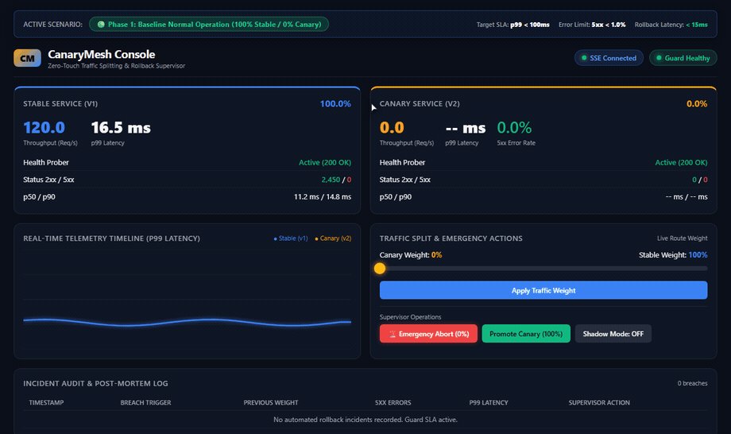
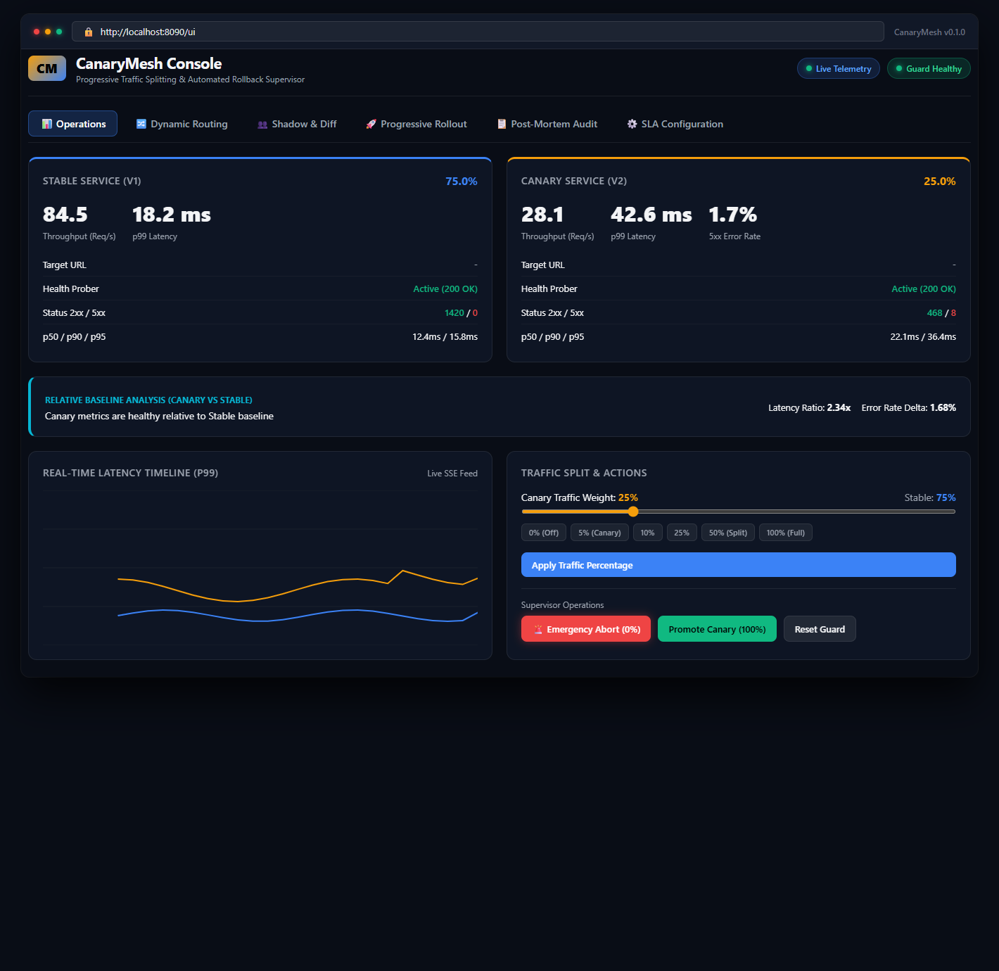
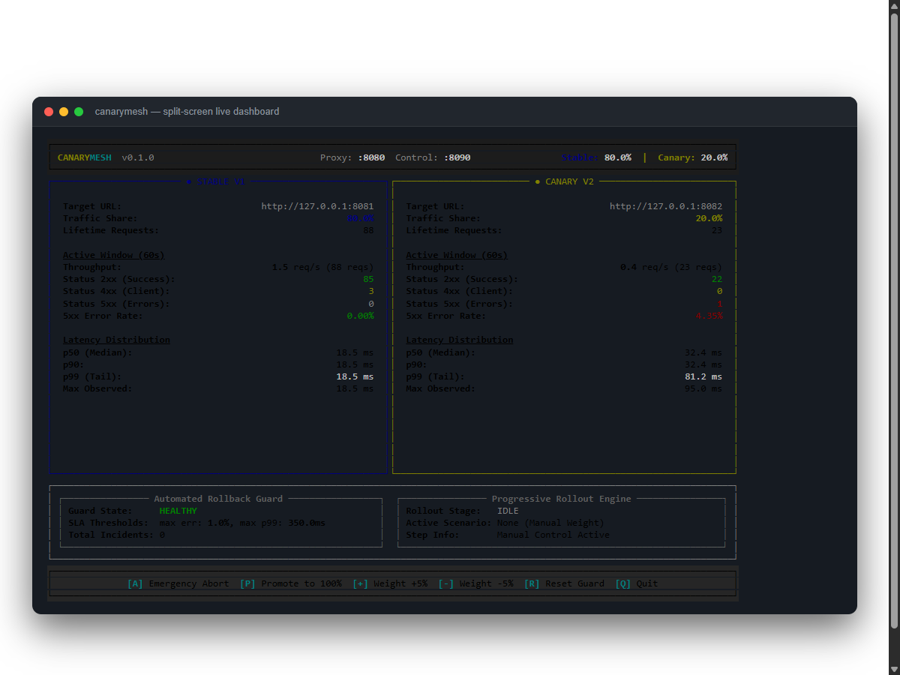

<p align="center">
  
</p>

<h1 align="center">CanaryMesh</h1>

<p align="center">
  <strong>Edge reverse proxy and automated rollback supervisor for progressive canary deployments.</strong>
</p>

<p align="center">
  <a href="https://www.python.org/downloads/"></a>
  <a href="https://fastapi.tiangolo.com"></a>
  <a href="https://www.python-httpx.org"></a>
  <a href="LICENSE"></a>
</p>

---

CanaryMesh splits incoming HTTP and WebSocket traffic between a stable upstream service (v1) and a canary service (v2) using dynamic weights, sticky sessions, request headers, or path prefixes. A background supervisor evaluates error rates, latency percentiles, and relative baseline degradation inside a rolling sliding window, cutting traffic to the canary service immediately if thresholds fail.

<p align="center">
  
</p>

## Live Operations Console

CanaryMesh includes an embedded operations console served at `http://localhost:8090/ui`. It connects over Server-Sent Events to provide live telemetry updates, interactive weight adjustments, dark launching toggles, dynamic path prefix and header rule controls, and automated incident audit logs.

<div align="center">
  
</div>

## Split-Screen Terminal Dashboard

For terminal environments, CanaryMesh provides an interactive split-screen dashboard powered by Rich. It compares Stable and Canary metrics side by side and supports keyboard hotkeys to abort, promote, or adjust weights on the fly.

<div align="center">
  
</div>

---

## Key capabilities

* **Zero buffer streaming**: Forwards HTTP requests, responses, and WebSockets as asynchronous streams without loading bodies into memory.
* **Flexible routing strategies**: Supports weighted percentage distribution, sticky cookie hashing, header matchers (`X-Canary: true`, regex patterns), and path prefix rules (`/api/v2/*`).
* **Traffic shadowing (dark launching) & diff inspector**: Duplicates live client requests to the canary in the background and computes response parity rates with zero impact on production responses.
* **Active health probing**: Periodically monitors upstream `/healthz` endpoints, gates rollout promotions, and proactively trips rollbacks on node failure.
* **Rolling telemetry engine**: Maintains per second status counts and latency quantiles (p50, p90, p95, p99) over a 60-second circular window with reservoir sampling.
* **Comparative rollback guard**: Inspects error rates, p99 latency, and relative degradation vs Stable baseline, reverting canary traffic to 0% upon an SLA breach.
* **Multi-channel alerts and post-mortems**: Dispatches formatted notifications to Discord Embeds, Slack Block Kit, Telegram Bot, PagerDuty Events v2, or webhooks, and writes downloadable incident post-mortem markdown reports.
* **Interactive web console**: Serves a single-page management dashboard at `/ui` with real-time canvas telemetry charts over Server-Sent Events, Dynamic Routing Studio, and SLA Configuration.
* **Terminal dashboard & rich CLI**: Displays real-time comparative metrics side by side using Rich and CLI commands for routing rules and incident audit.
* **Distributed tracing**: Propagates W3C `traceparent` and `x-request-id` headers for end-to-end visibility in Jaeger, Tempo, and OpenTelemetry.
* **Control plane API**: Exposes REST endpoints and Prometheus metrics on a separate management port.

---

## Quick start

### Installation

Requires Python 3.12 or newer.

```bash
git clone https://github.com/alexandrmotologa/canarymesh.git
cd canarymesh
uv venv
source .venv/bin/activate  # On Windows: .venv\Scripts\activate
uv pip install -e ".[dev]"
```

### Running with mock upstreams

Start mock stable (port 8081) and canary (port 8082) instances:

```bash
canarymesh mock --port-v1 8081 --port-v2 8082
```

In a separate terminal, start the CanaryMesh proxy with a 20% canary split, health probing, and traffic shadowing enabled:

```bash
canarymesh start --stable http://127.0.0.1:8081 --canary http://127.0.0.1:8082 --weight 20 --shadow
```

Open your browser to `http://localhost:8090/ui` to view the web console and control traffic interactively.

To run with the terminal split-screen dashboard:

```bash
canarymesh start --stable http://127.0.0.1:8081 --canary http://127.0.0.1:8082 --weight 20 --dashboard
```

Simulate traffic and inject faults into the canary upstream to trigger an automatic rollback:

```bash
canarymesh simulate --target http://127.0.0.1:8080 --rate 30 --inject-errors
```

---

## Control plane API and web console

CanaryMesh serves management endpoints on port 8090 by default:

* `GET /ui`: Interactive web operations console with real-time SSE chart.
* `GET /api/v1/canary/status`: Shows active weights, routing metrics, comparative baseline, and health status.
* `POST /api/v1/canary/weight`: Sets the canary traffic percentage (`{"weight": 25}`).
* `POST /api/v1/canary/abort`: Forces an immediate rollback, setting canary weight to 0%.
* `POST /api/v1/canary/promote`: Promotes the canary to receive 100% of traffic.
* `GET /api/v1/canary/sla`: Retrieves active SLA thresholds.
* `POST /api/v1/canary/sla`: Dynamically updates SLA parameters and relative degradation thresholds.
* `GET /api/v1/canary/rules`: Inspects active routing rules (headers, paths).
* `POST /api/v1/canary/rules/path`: Dynamically adds a path prefix rule (`{"path_prefix": "/checkout", "target": "canary"}`).
* `DELETE /api/v1/canary/rules/path/{rule_id}`: Removes a dynamic path prefix rule.
* `POST /api/v1/canary/rules/header`: Dynamically adds a header match rule (`{"header_name": "x-user-tier", "header_pattern": "beta.*"}`).
* `DELETE /api/v1/canary/rules/header/{rule_id}`: Removes a dynamic header rule.
* `GET /api/v1/canary/shadow`: Inspects traffic shadowing status.
* `POST /api/v1/canary/shadow`: Configures traffic mirroring (`{"enabled": true, "percentage": 100}`).
* `GET /api/v1/canary/shadow/diff`: Returns recent shadowed response diff comparisons and parity rates.
* `GET /api/v1/canary/incidents`: Lists generated rollback incident post-mortems.
* `GET /api/v1/canary/incidents/{id}`: Inspects structured incident data.
* `GET /api/v1/canary/incidents/{id}/download`: Downloads Markdown post-mortem report.
* `GET /api/v1/canary/health`: Checks upstream prober statuses.
* `GET /metrics`: Exports Prometheus metrics.
* `GET /api/v1/canary/live`: Streams live telemetry events over SSE.

---

## CLI reference

```bash
# Manage routing rules dynamically
canarymesh rules --control-url http://127.0.0.1:8090

# Inspect rollback post-mortems and view reports
canarymesh incidents --control-url http://127.0.0.1:8090
canarymesh incidents inc-07ca7209 --control-url http://127.0.0.1:8090

# Validate rollout scenario files
canarymesh validate-scenario scenarios/progressive-rollout.yaml
```

---

## License

MIT License. See [LICENSE](LICENSE) for details.
