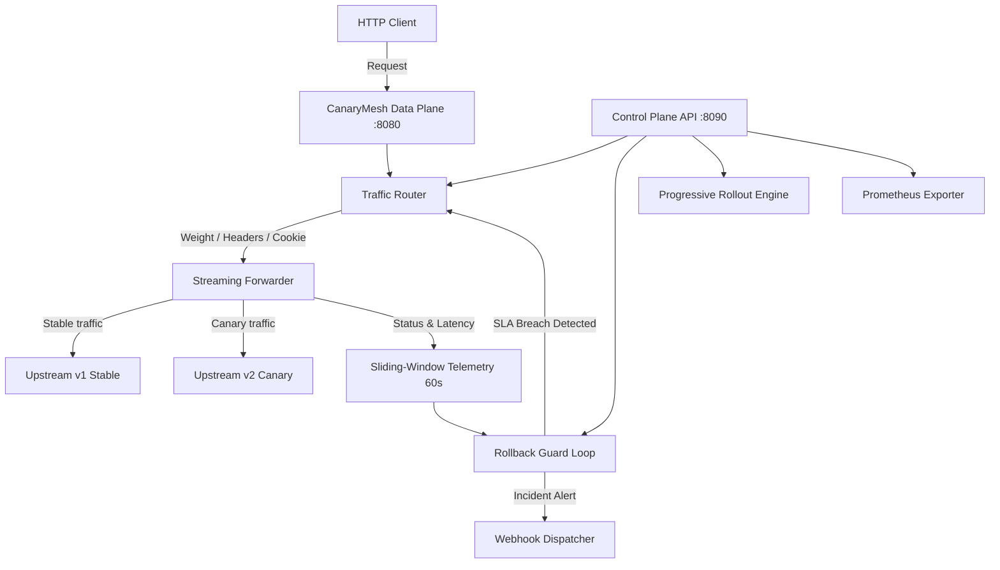

# Architecture

CanaryMesh operates as an edge reverse proxy and automated rollback controller. It inspects incoming HTTP requests, selects either the stable (v1) or canary (v2) upstream service, streams traffic without buffering payloads, and monitors upstream responses in real time.

## System layers

### Data plane

The data plane listens on port 8080 by default. It uses an asynchronous streaming client built with HTTPX. Because requests and responses stream directly between the client and upstream targets, memory consumption remains flat regardless of body size.

The proxy strips standard hop-by-hop headers, including `connection`, `transfer-encoding`, and `keep-alive`, before forwarding. It appends standard proxy headers (`X-Forwarded-For`, `X-Forwarded-Proto`) and an identification header (`X-Canary-Routed`).

### Control plane

The control plane runs independently on port 8090. It provides REST management endpoints, a Prometheus `/metrics` scraper target, and a Server-Sent Events stream (`/api/v1/live`) for real-time telemetry subscribers.

Separating the control plane from the data plane prevents management traffic and metrics scraping from competing with client request processing.

### Telemetry engine

CanaryMesh tracks telemetry in a sliding 60-second window. The window consists of 1-second slots that record success counts (2xx, 3xx), client errors (4xx), server errors (5xx), and individual latency observations.

Percentiles (p50, p90, p95, p99) and error percentages are calculated on demand from the active slots. Older slots are pruned during recording and snapshotting to keep memory use bounded.

### Rollback guard

The rollback guard evaluates canary telemetry once per second. If the canary error rate or p99 latency exceeds configured thresholds over the active sample window, the guard trips.

When tripped, the guard reduces canary weight to 0% and sends an alert payload to configured webhooks.
