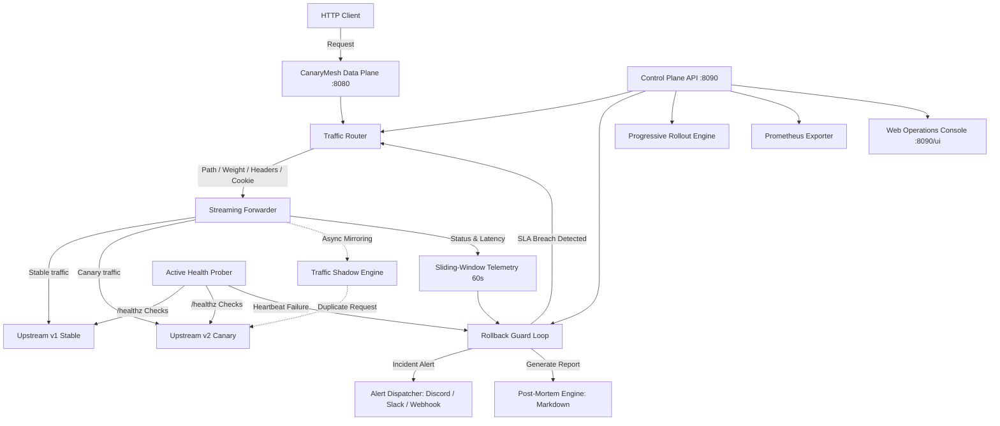

# Architecture

CanaryMesh operates as an edge reverse proxy and automated rollback controller. It inspects incoming HTTP requests, selects either the stable (v1) or canary (v2) upstream service, streams traffic without buffering payloads, and monitors upstream responses in real time.

## System layers

### Data plane

The data plane listens on port 8080 by default. It uses an asynchronous streaming client built with HTTPX. Because requests and responses stream directly between the client and upstream targets, memory consumption remains flat regardless of body size.

The proxy strips standard hop-by-hop headers, including `connection`, `transfer-encoding`, and `keep-alive`, before forwarding. It appends standard proxy headers (`X-Forwarded-For`, `X-Forwarded-Proto`) and an identification header (`X-Canary-Routed`).

### Asynchronous traffic shadowing (dark launching)

When enabled, the proxy clones incoming client requests and mirrors them to the canary upstream asynchronously. 
The client receives the response from the primary upstream immediately without waiting for the mirrored execution. The background response is consumed and recorded into shadow telemetry, allowing teams to test real production load without risking customer experience.

### Control plane and web operations console

The control plane runs independently on port 8090. It provides:
- REST management endpoints for weights, routing rules, shadow traffic, and incidents.
- An embedded Web Operations Console at `/ui`, featuring live telemetry charts, weight controls, emergency abort triggers, and dynamic rule management.
- A Prometheus `/metrics` scraper target.
- A Server-Sent Events stream (`/api/v1/canary/live`) broadcasting state and metrics every second.

Separating the control plane from the data plane prevents management traffic and metrics scraping from competing with client request processing.

### Telemetry engine

CanaryMesh tracks telemetry in a sliding 60-second window. The window consists of 1-second slots that record success counts (2xx, 3xx), client errors (4xx), server errors (5xx), and individual latency observations.

Percentiles (p50, p90, p95, p99) and error percentages are calculated on demand from the active slots. Older slots are pruned during recording and snapshotting to keep memory use bounded.

### Active health probing

The health prober runs background polling against configured upstream health endpoints (e.g. `/healthz`). It tracks consecutive successes and failures:
- If a canary node fails health checks consecutively, the prober flags it as unhealthy.
- The rollback guard evaluates prober status and immediately trips a rollback if the canary becomes unreachable, avoiding having to wait for client traffic to fail.
- The progressive rollout engine checks prober health before advancing each deployment stage.

### Rollback guard and incident post-mortem

The rollback guard evaluates canary telemetry once per second. If the canary error rate or p99 latency exceeds configured thresholds over the active sample window, or if the active health prober detects failure, the guard trips.

When tripped:
1. Canary weight is immediately forced to 0%.
2. Alerts are dispatched to configured channels (Discord Embeds, Slack Block Kit, or generic JSON webhooks).
3. The Post-Mortem engine captures a snapshot of the telemetry at the exact moment of failure and generates a detailed incident markdown document in `incidents/inc-<id>.md`.
