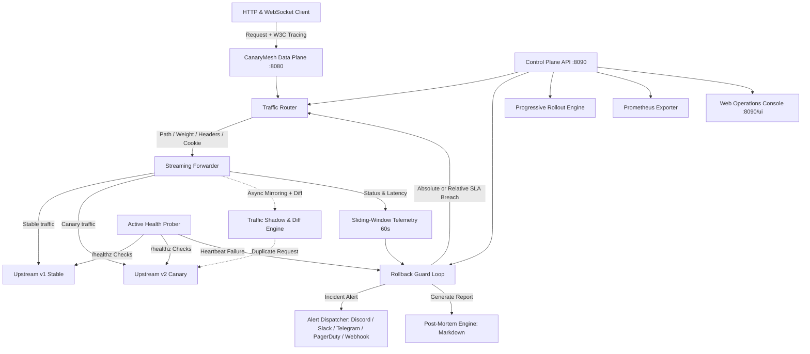

# Architecture

CanaryMesh operates as an edge reverse proxy and automated rollback controller. It inspects incoming HTTP and WebSocket requests, selects either the stable (v1) or canary (v2) upstream service, streams traffic without buffering payloads, and monitors upstream responses in real time.

```mermaid
graph TD
    Client[HTTP & WebSocket Client] -->|Request + W3C Tracing| Proxy[CanaryMesh Data Plane :8080]
    Proxy --> Router[Traffic Router]
    Router -->|Path / Weight / Headers / Cookie| Forwarder[Streaming Forwarder]
    Forwarder -->|Stable traffic| Stable[Upstream v1 Stable]
    Forwarder -->|Canary traffic| Canary[Upstream v2 Canary]
    Forwarder -.->|Async Mirroring + Diff| Shadow[Traffic Shadow & Diff Engine]
    Shadow -.->|Duplicate Request| Canary
    
    Forwarder -->|Status & Latency| Telemetry[Sliding-Window Telemetry 60s]
    Telemetry --> Guard[Rollback Guard Loop]
    Prober[Active Health Prober] -->|/healthz Checks| Stable
    Prober -->|/healthz Checks| Canary
    Prober -->|Heartbeat Failure| Guard
    Guard -->|Absolute or Relative SLA Breach| Router
    Guard -->|Incident Alert| Webhook[Alert Dispatcher: Discord / Slack / Telegram / PagerDuty / Webhook]
    Guard -->|Generate Report| PostMortem[Post-Mortem Engine: Markdown]
    
    API[Control Plane API :8090] --> Router
    API --> Guard
    API --> Rollout[Progressive Rollout Engine]
    API --> Metrics[Prometheus Exporter]
    API --> WebUI[Web Operations Console :8090/ui]
```

## System layers

### Data plane

The data plane listens on port 8080 by default. It uses an asynchronous streaming client built with HTTPX and native WebSocket forwarding. Because requests and responses stream directly between the client and upstream targets, memory consumption remains flat regardless of payload size.

The proxy strips standard hop-by-hop headers, including `connection`, `transfer-encoding`, `keep-alive`, and `content-length` for chunked streams, before forwarding. It propagates standard proxy headers (`X-Forwarded-For`, `X-Forwarded-Proto`), an identification header (`X-Canary-Routed`), `X-Request-ID`, and standard W3C `traceparent` context.

### Asynchronous traffic shadowing and response diffing

When enabled, the proxy clones incoming client requests and mirrors them to the canary upstream asynchronously. 
The client receives the response from the primary upstream immediately without waiting for the mirrored execution. The background response is consumed and compared against the stable response, tracking response status matches and calculating a live **Response Parity Rate (%)**.

### Control plane and web operations console

The control plane runs independently on port 8090. It provides:
- REST management endpoints for weights, routing rules (path and header matchers), shadow diffing, SLA parameters, and incident post-mortems.
- An embedded Web Operations Console at `/ui` with tabbed operations: Live Telemetry, Dynamic Routing Studio, Shadow & Diff Inspector, Rollout Workflow, Incident Post-Mortems, and SLA Configuration.
- A Prometheus `/metrics` scraper target.
- A Server-Sent Events stream (`/api/v1/canary/live`) broadcasting state, comparative baseline metrics, and telemetry every second.

### Telemetry engine with reservoir sampling

CanaryMesh tracks telemetry in a sliding 60-second window. The window consists of 1-second slots that record success counts (2xx, 3xx), client errors (4xx), server errors (5xx), and individual latency observations with reservoir sampling ($O(1)$ memory overhead).

Percentiles (p50, p90, p95, p99) and relative degradation deltas are calculated on demand from the active slots. Older slots are pruned during recording and snapshotting to keep memory use bounded.

### Active health probing

The health prober runs background polling against configured upstream health endpoints (e.g. `/healthz`). It tracks consecutive successes and failures:
- If a canary node fails health checks consecutively, the prober flags it as unhealthy.
- The rollback guard evaluates prober status and immediately trips a rollback if the canary becomes unreachable.
- The progressive rollout engine checks prober health before advancing each deployment stage.

### Rollback guard and incident post-mortem

The rollback guard evaluates canary telemetry once per second against both absolute thresholds and relative degradation vs the Stable baseline.

When tripped:
1. Canary weight is immediately forced to 0%.
2. Alerts are dispatched to configured channels (Discord Embeds, Slack Block Kit, Telegram Bot, PagerDuty Events v2, or generic JSON webhooks).
3. The Post-Mortem engine captures a snapshot of the telemetry at the exact moment of failure and generates a detailed incident markdown document in `incidents/inc-<id>.md` available for direct download via the Web Console or API.
